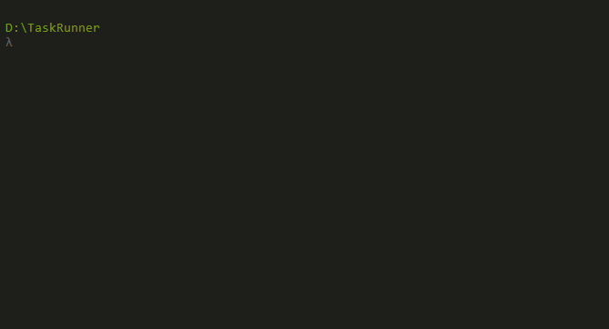

# A tool to run tasks in EPiServer context



# An example task:
```cs
public class SampleTask1
{
    private readonly IContentRepository _contentRepository;

    public event EventHandler<ProgressChangedEventArgs> Progress;

    public SampleTask1(IContentRepository contentRepository)
    {
        _contentRepository = contentRepository;
    }

    public void Execute()
    {        
        var totalPages = 20;

        for (int i = 1; i < totalPages; i++)
        {                
            var articlePage = _contentRepository.GetDefault<ArticlePage>(ContentReference.StartPage);
            articlePage.Name = "First sample page " + i;
            _contentRepository.Save(articlePage, SaveAction.Publish, AccessLevel.NoAccess);
            Progress?.Invoke(this, new ProgressChangedEventArgs((100 * i)/ totalPages, null));
        }

        Progress?.Invoke(this, new ProgressChangedEventArgs(100, null));
    }
}
```